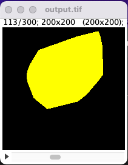

# Rasterize Neuron

This tutorial describes how to integrate a volume which is covered by the arbors of a specific neuron. In this example, one neuron from Ye, et. al 2021 is integrated in a small subvolume. This example could be built apon to do analysis on a much larger volume, but it can be computationally expensive.

## Running this code
Follow these steps to run this example:

1. Download the github directory, as it includes the example SWC files
2. Run the jupyter notebook named `rasterize_neuron.ipynb`.
    - You may need to install the `pip` `tqdm` package because it is not a dependency of the ngauge package, or comment out the sections which reference it as it is optional.

## Result
Running this code results in a single TIF file `output.tif`, which is included zipped in the github repository. This is a binary TIF file where the values are either `0` for a background pixel or `1` for a volume pixel. This can be visualized in software such as Fiji using a LUT such as "Glasbey on Dark" which can help highlight categorical data:

