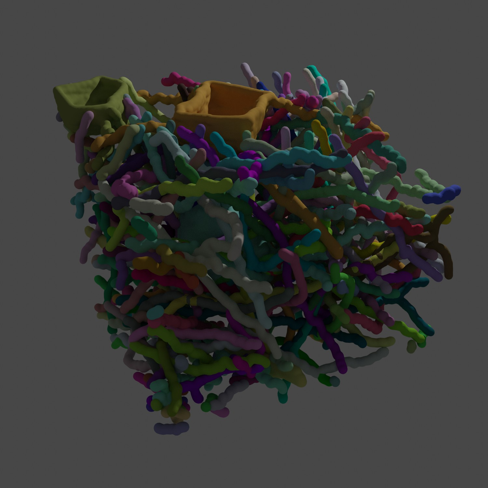

# Render neurons in Blender

In this example, we show how to render a collection of neurons and neurite fragments, as previously published in our nTracer manuscript
(in folder *ntracer_tracing_swc*):

```
Douglas H Roossien, Benjamin V Sadis, Yan Yan, John M Webb, Lia Y Min, Aslan S Dizaji,
Luke J Bogart, Cristina Mazuski, Robert S Huth, Johanna S Stecher, Sriakhila Akula,
Fred Shen, Ye Li, Tingxin Xiao, Madeleine Vandenbrink, Jeff W Lichtman, Takao K Hensch,
Erik D Herzog, Dawen Cai, Multispectral tracing in densely labeled mouse brain with nTracer,
Bioinformatics, Volume 35, Issue 18, 15 September 2019, Pages 3544–3546,
https://doi.org/10.1093/bioinformatics/btz084
```

## Running this code
Follow these steps to run this example:

1. Download the github directory, as it includes the example SWC files
2. Open Blender, with the example data in the Blender root
    - This can be done in Unix-like systems by starting Blender from a terminal
    inside of the tutorial folder
3. Switch to the "scripting" tab in Blender
4. Create a new script, and copy `render_neuron_in_blender.py` into it (or simply copy the file into the Blender project)
5. Run by clicking the button in the top bar
6. This will generate one 3D mesh per neuron using the settings laid out in the render script
7. Perform manipulation of the 3D model or rendering using the standard Blender tools

## Result
This is  the result of running this code, saved to a JPG using the Cycles renderer in Blender
