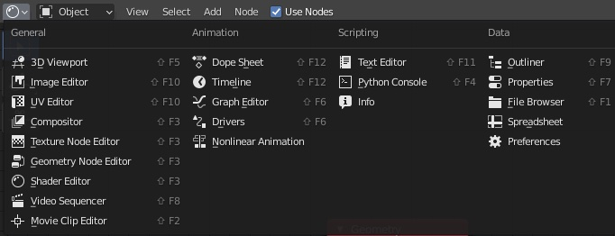
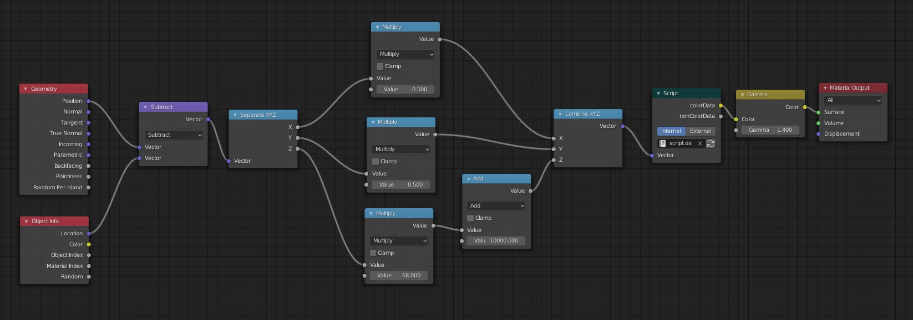
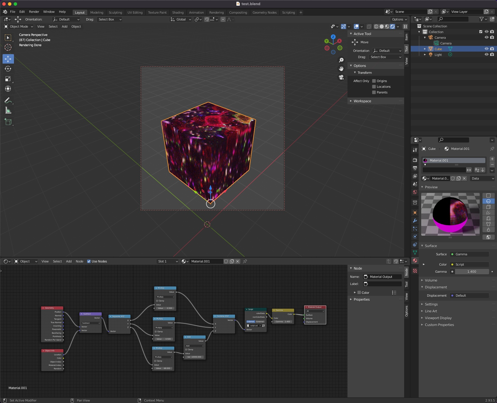
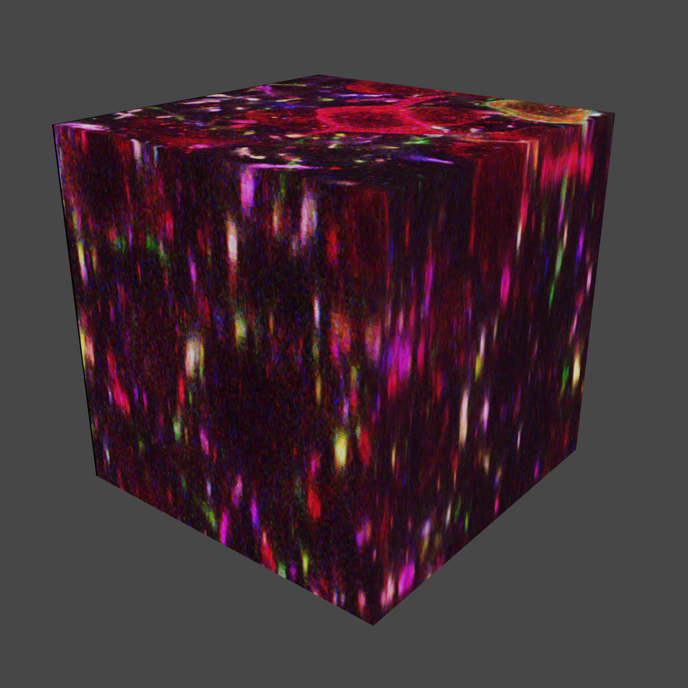

# Render volumetric microscopy data in Blender

In this example, we show how to render volumetric microscopy data using Blender, as we utilized in Figure 8C of
the nGauge manuscript. Specifically, we will use a TIFF stack from our nTracer manuscript to demonstrate
these principles:

```
Douglas H Roossien, Benjamin V Sadis, Yan Yan, John M Webb, Lia Y Min, Aslan S Dizaji,
Luke J Bogart, Cristina Mazuski, Robert S Huth, Johanna S Stecher, Sriakhila Akula,
Fred Shen, Ye Li, Tingxin Xiao, Madeleine Vandenbrink, Jeff W Lichtman, Takao K Hensch,
Erik D Herzog, Dawen Cai, Multispectral tracing in densely labeled mouse brain with nTracer,
Bioinformatics, Volume 35, Issue 18, 15 September 2019, Pages 3544–3546,
https://doi.org/10.1093/bioinformatics/btz084
```

## Before Starting
To run this code, you will need a version of Blender which has OSL (Open Shade Language) support built into the binary.
In theory, most versions of Blender have this, but in practice this is not true, because it requires additional
compilier flags. Below I have an (incomplete) list of all of the builds that have been tested, but your mileage
will vary:

**Versions that have confirmed to work with OSL**
- The installers available on the Blender website
- Binaries available from Ubuntu `snap` repository

**Versions that do *not* have OSL**
- Binaries available from Ubuntu `apt` repository

## Running this code
1. Download the nTracer example image from our lab website (https://www.cai-lab.org/ntracer-tutorial).
    - This process should work with other images, but we recommend testing with a small image first, due to the computational complexity of the process.
2. Separate this image stack into a folder of all slices. This can be done in Fiji/ImageJ:
    1. Open the TIFF file.
    2. Convert the image to RGB (`Type Menu > RGB Color`).
    3. Export the stack as a collection of PNG files (`Save As > Image Sequence...`)
    4. Select a folder and export.
3. Open Blender (make sure you are aware of the warning in *Before Starting*) and open a new document.
4. Click on the Scripting tab on the top bar and create a new script named "script.osl"
5. Paste the script "shader.osl" into the scripting editor.
6. Inside the script, change the `path` variable to the folder with your image data inside of it and save.
7. Switch back to the Layout tab.
8. Create an object in the viewport by using the "Add menu". A cube works well because image z-stacks are typically rectangular in shape,
 but theoretically you can apply this technique to any shape you desire. One useful shape is a cube with a section cut out of the side, so that
 you can reveal the "interior" of the data block.
9. Click on your new object and click on the "material" menu in the right-side context menu.
10. Click on the "+" button on the material list and create a new texture and name it something memorable.
11. Change one of the menu panels to the "Shader Editor" mode, which allows you to change the struture of your new shader.



12. Setup your shader by creating nodes connected in a manner similar to what you see below
(unfortunately I have not found a resonable way to just export this structure).
An outline of the different columns is below:
    1. `Geometry` and `Object Info` nodes are used to get the location of a voxel being rendered.
    2. `Subtract` is used to locate a single voxel by subtracting the offset of the object.
    3. `Separate XYZ` turns the vector into its components.
    4. `Multiply` is used to scale each components (the XY coordinates should stay the same with different images, but they Z is approximately 1/2 the number of z slices).
    6. `Add` is used to offset the z-slice indexing by 10,000, to offset the image indexing (this is optional based on your image names).
    7. `Combine XYZ` turns these individual coordinates back to one vector.
    8. `Script` is used to execute a OSL shader, with the script you created above selected.
    9. `Gamma` is optional, but allows you to apply a gamma correction to the image.
    10. `Material Output` sends the shader to the object.
        - If you apply the shader to the "Surface" output, the cube will render as a hollow object, and only the edges will be rendered.
        This is usually what you want, as it has some performance benefits.
        - If you apply the shader to the "Volume" output, the cube will render as a solid block. Depending on your opacity
        settings it allows you to render the interior of the object, but it is computationally **INTENSE**, it can take more
        than 30X the time of doing a surface render.



13. Switch your rendering system to Cycles-CPU with OSL enabled in the viewport. 
14. You should see something like below when you are done:




## Results

The following image was created by performing a CPU Cycles on a 2021 M1 Pro MacBook Pro in 40.6s:

